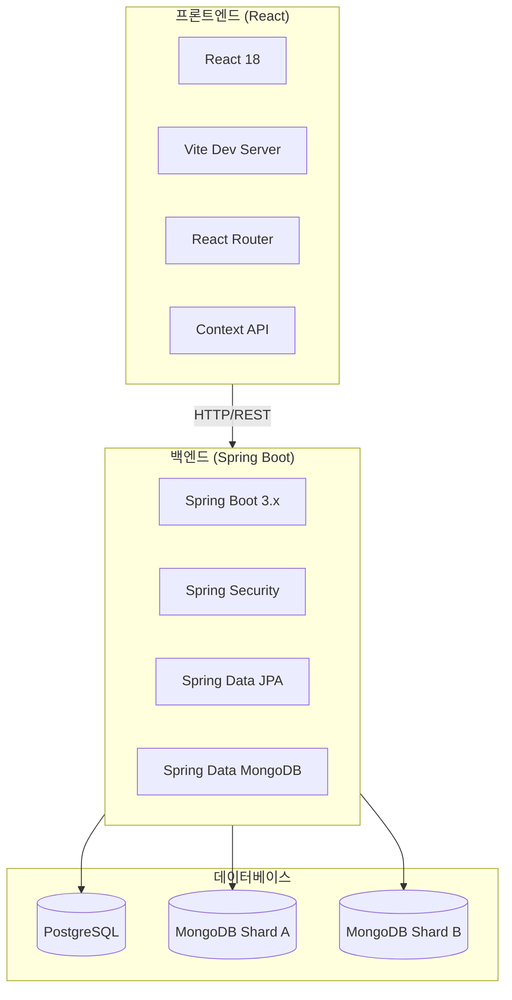
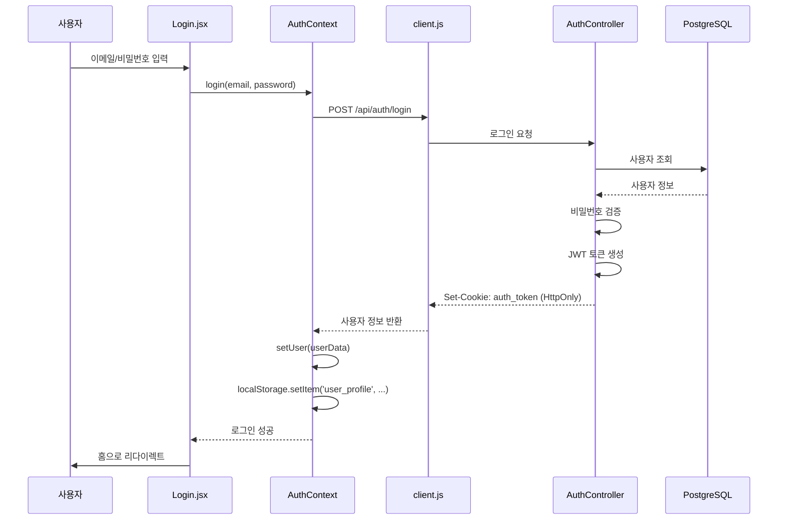
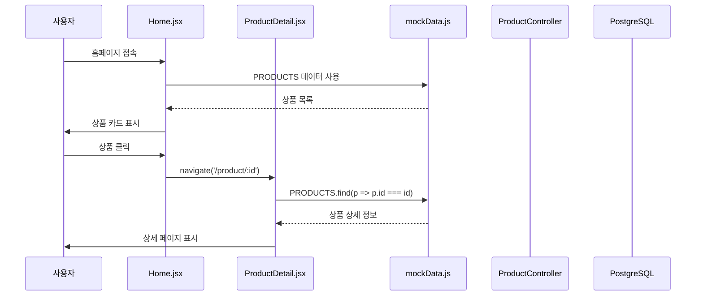
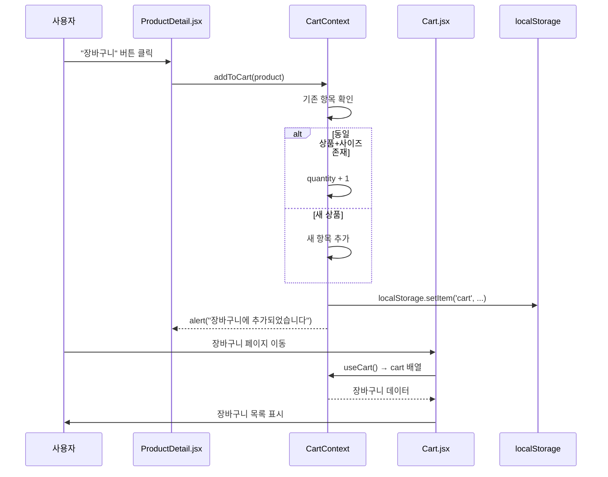
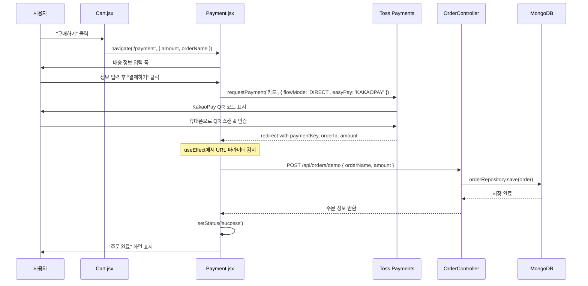
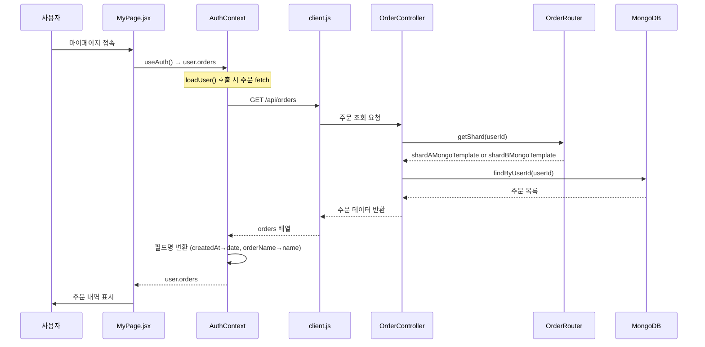
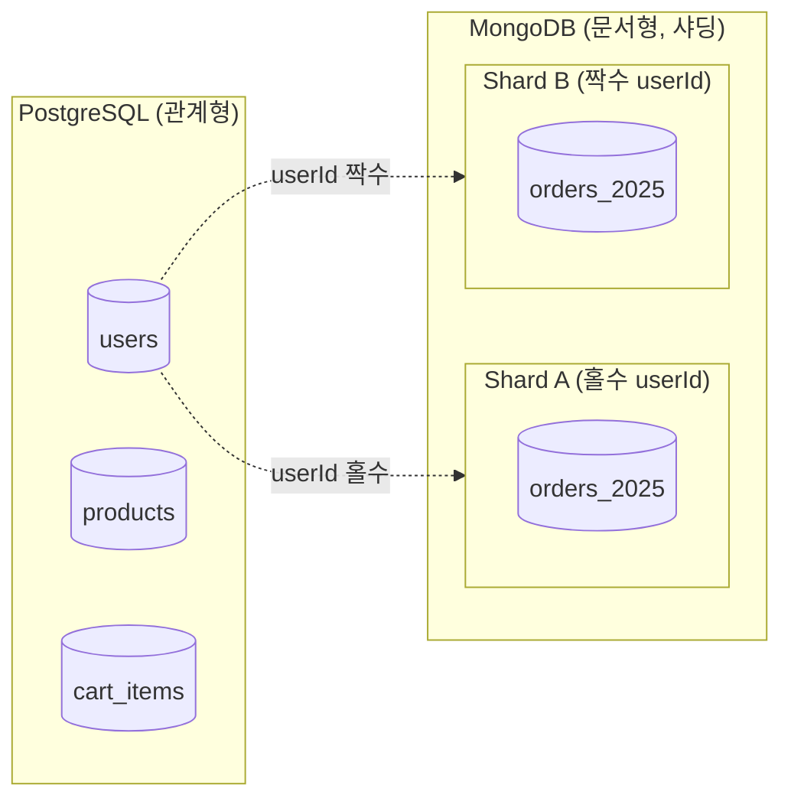
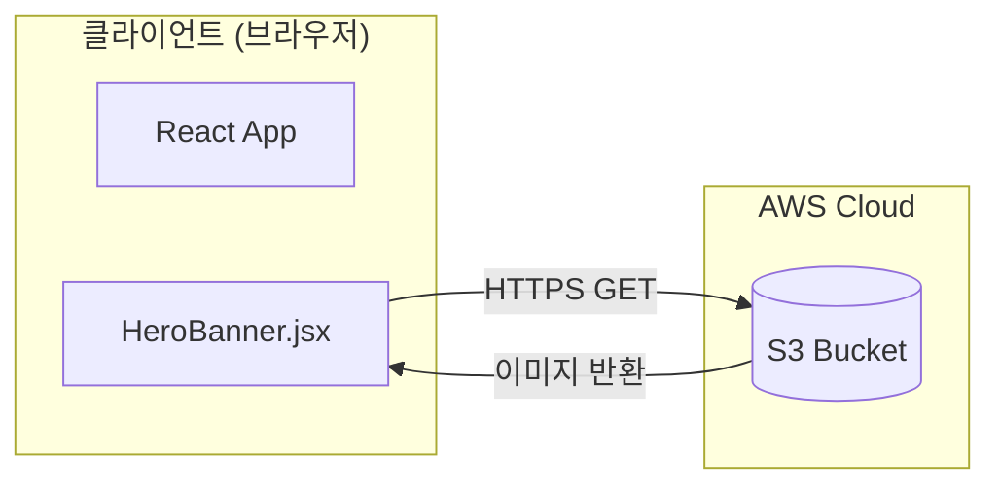
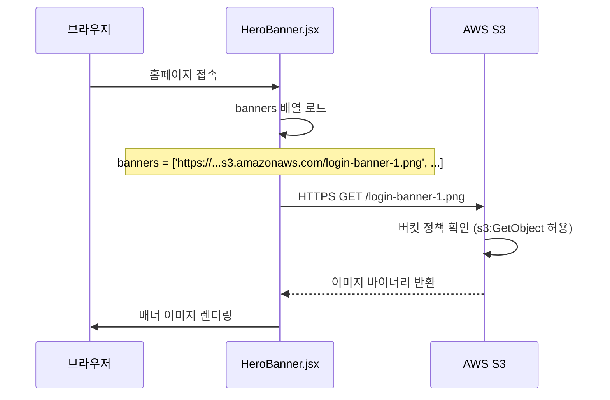

# 11st 클론 프로젝트 - 전체 아키텍처 및 기능 흐름 문서

## 1. 프로젝트 개요

11번가 쇼핑몰을 벤치마킹한 클론 프로젝트입니다. React 프론트엔드, Spring Boot 백엔드, PostgreSQL + MongoDB 하이브리드 데이터베이스 아키텍처로 구성되어 있습니다.

---

## 2. 기술 스택



| 계층 | 기술 | 역할 |
|------|------|------|
| **Frontend** | React 18 + Vite | UI 렌더링 |
| **상태관리** | Context API | 인증(AuthContext), 장바구니(CartContext) |
| **HTTP 클라이언트** | Axios | API 통신 (`src/api/client.js`) |
| **Backend** | Spring Boot 3.x | REST API 서버 |
| **인증** | Spring Security + JWT (HttpOnly Cookie) | 사용자 인증 |
| **User/Product DB** | PostgreSQL | 사용자, 상품 데이터 |
| **Order DB** | MongoDB (2 Shards) | 주문 데이터 (샤딩) |
| **결제** | Toss Payments (KakaoPay) | 결제 연동 |

---

## 3. 프로젝트 구조

### 3.1 프론트엔드 구조 (`src/`)

```
src/
├── App.jsx              # 라우팅 설정
├── main.jsx             # 엔트리 포인트
├── api/
│   ├── client.js        # Axios 인스턴스 (baseURL: /api)
│   └── mockData.js      # 목업 데이터 (PRODUCTS, COUPONS, REVIEWS)
├── context/
│   ├── AuthContext.jsx  # 인증 상태 관리
│   └── CartContext.jsx  # 장바구니 상태 관리
├── components/
│   ├── layout/          # Header, Footer, Layout
│   ├── home/            # 홈 페이지 컴포넌트
│   └── Sidebar.jsx      # 햄버거 메뉴
└── pages/               # 13개 페이지
    ├── Home.jsx
    ├── ProductDetail.jsx
    ├── Cart.jsx
    ├── Payment.jsx
    ├── Login.jsx
    ├── Signup.jsx
    ├── MyPage.jsx
    └── ...
```

### 3.2 백엔드 구조 (`backend/src/main/java/com/clone/backend/`)

```
backend/
├── BackendApplication.java    # Spring Boot 메인
├── config/
│   ├── SecurityConfig.java    # Spring Security 설정
│   └── MongoConfig.java       # MongoDB 샤드 설정
├── controller/
│   ├── AuthController.java    # /api/auth/* (로그인, 회원가입)
│   ├── ProductController.java # /api/products/*
│   ├── CartController.java    # /api/cart/*
│   ├── OrderController.java   # /api/orders/*
│   ├── UserController.java    # /api/users/*
│   └── OAuthController.java   # OAuth 콜백 처리
├── model/
│   ├── User.java              # 사용자 엔티티 (PostgreSQL)
│   ├── Product.java           # 상품 엔티티 (PostgreSQL)
│   ├── CartItem.java          # 장바구니 항목 (PostgreSQL)
│   ├── Order.java             # 주문 POJO (MongoDB)
│   └── OrderItem.java         # 주문 항목 POJO (MongoDB)
├── repository/
│   ├── UserRepository.java    # JPA Repository
│   ├── ProductRepository.java
│   ├── CartRepository.java
│   └── OrderRepository.java   # 커스텀 MongoDB Repository
├── service/
│   └── AuthService.java       # 인증 비즈니스 로직
├── security/
│   └── JwtTokenProvider.java  # JWT 토큰 생성/검증
└── sharding/
    └── OrderRouter.java       # MongoDB 샤딩 라우터
```

---

## 4. 핵심 기능 흐름

### 4.1 인증 흐름 (로그인/회원가입)



**관련 파일:**
| 위치 | 파일 | 역할 |
|------|------|------|
| Frontend | [Login.jsx](file:///c:/Users/yoons/OneDrive/문서/GitHub/11st_Benchmarking/src/pages/Login.jsx) | 로그인 UI, 폼 처리 |
| Frontend | [AuthContext.jsx](file:///c:/Users/yoons/OneDrive/문서/GitHub/11st_Benchmarking/src/context/AuthContext.jsx) | `login()`, `loadUser()`, `logout()` 함수 |
| Frontend | [client.js](file:///c:/Users/yoons/OneDrive/문서/GitHub/11st_Benchmarking/src/api/client.js) | axios 인스턴스 (`withCredentials: true`) |
| Backend | [AuthController.java](file:///c:/Users/yoons/OneDrive/문서/GitHub/11st_Benchmarking/backend/src/main/java/com/clone/backend/controller/AuthController.java) | `/api/auth/login`, `/api/auth/signup` |
| Backend | [AuthService.java](file:///c:/Users/yoons/OneDrive/문서/GitHub/11st_Benchmarking/backend/src/main/java/com/clone/backend/service/AuthService.java) | 비즈니스 로직 (비밀번호 암호화 등) |

**핵심 함수:**

```javascript
// AuthContext.jsx - login 함수
const login = async (email, password) => {
    const response = await client.post('/auth/login', { email, password });
    const userResponse = response.data.user;
    setUser(finalUser);
    localStorage.setItem('user_profile', JSON.stringify(finalUser));
    return finalUser;
};
```

---

### 4.2 상품 조회 흐름



**관련 파일:**
| 위치 | 파일 | 역할 |
|------|------|------|
| Frontend | [Home.jsx](file:///c:/Users/yoons/OneDrive/문서/GitHub/11st_Benchmarking/src/pages/Home.jsx) | 메인 페이지 레이아웃 |
| Frontend | [ProductDetail.jsx](file:///c:/Users/yoons/OneDrive/문서/GitHub/11st_Benchmarking/src/pages/ProductDetail.jsx) | 상품 상세 (수량 선택, 장바구니 담기) |
| Frontend | [mockData.js](file:///c:/Users/yoons/OneDrive/문서/GitHub/11st_Benchmarking/src/api/mockData.js) | `PRODUCTS` 배열 |
| Backend | [ProductController.java](file:///c:/Users/yoons/OneDrive/문서/GitHub/11st_Benchmarking/backend/src/main/java/com/clone/backend/controller/ProductController.java) | `/api/products` |

---

### 4.3 장바구니 흐름



**관련 파일:**
| 위치 | 파일 | 역할 |
|------|------|------|
| Frontend | [ProductDetail.jsx](file:///c:/Users/yoons/OneDrive/문서/GitHub/11st_Benchmarking/src/pages/ProductDetail.jsx#L116-125) | `handleAddToCart()` 함수 |
| Frontend | [CartContext.jsx](file:///c:/Users/yoons/OneDrive/문서/GitHub/11st_Benchmarking/src/context/CartContext.jsx) | `addToCart()`, `removeFromCart()`, `updateQuantity()`, `clearCart()` |
| Frontend | [Cart.jsx](file:///c:/Users/yoons/OneDrive/문서/GitHub/11st_Benchmarking/src/pages/Cart.jsx) | 장바구니 페이지 UI |

**핵심 함수:**

```javascript
// CartContext.jsx - addToCart
const addToCart = (product) => {
    setCart((prev) => {
        const existing = prev.find(item => 
            item.id === product.id && item.selectedSize === product.selectedSize
        );
        if (existing) {
            return prev.map(item => 
                item.id === product.id && item.selectedSize === product.selectedSize
                    ? { ...item, quantity: item.quantity + 1 }
                    : item
            );
        }
        return [...prev, { ...product, cartItemId, quantity: 1 }];
    });
};
```

---

### 4.4 결제 흐름 (KakaoPay 데모)



**관련 파일:**
| 위치 | 파일 | 역할 |
|------|------|------|
| Frontend | [Cart.jsx](file:///c:/Users/yoons/OneDrive/문서/GitHub/11st_Benchmarking/src/pages/Cart.jsx) | 결제 페이지로 이동 |
| Frontend | [Payment.jsx](file:///c:/Users/yoons/OneDrive/문서/GitHub/11st_Benchmarking/src/pages/Payment.jsx#L190-215) | `handleKakaoPayment()`, 결제 후 처리 |
| Backend | [OrderController.java](file:///c:/Users/yoons/OneDrive/문서/GitHub/11st_Benchmarking/backend/src/main/java/com/clone/backend/controller/OrderController.java#L122-160) | `/api/orders/demo` (데모 모드) |
| Backend | [Order.java](file:///c:/Users/yoons/OneDrive/문서/GitHub/11st_Benchmarking/backend/src/main/java/com/clone/backend/model/Order.java) | 주문 POJO |
| Backend | [OrderRouter.java](file:///c:/Users/yoons/OneDrive/문서/GitHub/11st_Benchmarking/backend/src/main/java/com/clone/backend/sharding/OrderRouter.java) | 샤딩 로직 |

**핵심 함수:**

```javascript
// Payment.jsx - KakaoPay 결제 시작
const handleKakaoPayment = async () => {
    const tossPayments = await loadTossPayments(clientKey);
    await tossPayments.requestPayment('카드', {
        amount: finalAmount,
        orderId: orderId,
        orderName: orderName,
        flowMode: 'DIRECT',
        easyPay: 'KAKAOPAY',
        successUrl: window.location.origin + `/payment?orderName=${encodeURIComponent(orderName)}`,
    });
};
```

---

### 4.5 주문 내역 조회 흐름



**관련 파일:**
| 위치 | 파일 | 역할 |
|------|------|------|
| Frontend | [MyPage.jsx](file:///c:/Users/yoons/OneDrive/문서/GitHub/11st_Benchmarking/src/pages/MyPage.jsx) | 주문 내역 UI |
| Frontend | [AuthContext.jsx](file:///c:/Users/yoons/OneDrive/문서/GitHub/11st_Benchmarking/src/context/AuthContext.jsx#L29-43) | `loadUser()` - 주문 fetch 및 필드 매핑 |
| Backend | [OrderController.java](file:///c:/Users/yoons/OneDrive/문서/GitHub/11st_Benchmarking/backend/src/main/java/com/clone/backend/controller/OrderController.java#L115-120) | `getOrders()` |
| Backend | [OrderRepository.java](file:///c:/Users/yoons/OneDrive/문서/GitHub/11st_Benchmarking/backend/src/main/java/com/clone/backend/repository/OrderRepository.java) | MongoDB 조회 (전체 샤드 탐색) |
 
 ---
 
 ### 4.6 주문 취소 (삭제) 흐름 - [NEW]
 
 주문 기록을 영구 삭제하는 기능입니다.
 
 ```mermaid
 sequenceDiagram
     participant User as 사용자
     participant MyPage as MyPage.jsx
     participant Auth as AuthContext
     participant Backend as OrderController
     participant Repo as OrderRepository
     participant Mongo as MongoDB (Shards)
 
     User->>MyPage: "주문취소" 버튼 클릭
     MyPage->>Auth: cancelOrder(orderId)
     Auth->>User: confirm("취소하시겠습니까?")
     User-->>Auth: 확인
     Auth->>Backend: DELETE /api/orders/{orderId}
     Backend->>Repo: delete(user, orderId)
     Repo->>Repo: 유저ID로 샤드 결정
     Note over Repo: 최근 2년치 컬렉션 스캔 (orders_2024, 2025...)
     Repo->>Mongo: remove(query)
     Mongo-->>Repo: 삭제 완료 (DeletedCount > 0)
     Backend-->>Auth: 200 OK
     Auth->>Auth: 로컬 state 업데이트 (UI 즉시 반영)
     Auth->>User: alert("취소되었습니다")
 ```
 
 **관련 파일:**
 | 위치 | 파일 | 역할 |
 |------|------|------|
 | Frontend | [MyPage.jsx](file:///c:/Users/yoons/OneDrive/문서/GitHub/11st_Benchmarking/src/pages/MyPage.jsx) | 취소 버튼 및 리뷰 모달 포함 |
 | Frontend | [AuthContext.jsx](file:///c:/Users/yoons/OneDrive/문서/GitHub/11st_Benchmarking/src/context/AuthContext.jsx) | `cancelOrder()`: API 호출 및 상태 갱신 |
 | Backend | [OrderController.java](file:///c:/Users/yoons/OneDrive/문서/GitHub/11st_Benchmarking/backend/src/main/java/com/clone/backend/controller/OrderController.java) | `DELETE /api/orders/{id}` |
 | Backend | [OrderRepository.java](file:///c:/Users/yoons/OneDrive/문서/GitHub/11st_Benchmarking/backend/src/main/java/com/clone/backend/repository/OrderRepository.java) | `delete()`: 샤딩된 DB에서 Hard Delete 수행 |

---

## 5. 데이터베이스 아키텍처

### 5.1 하이브리드 구조



### 5.2 샤딩 로직

```java
// OrderRouter.java
public MongoTemplate getShard(Long userId) {
    return (userId % 2 != 0) ? shardA : shardB;  // 홀수 → A, 짝수 → B
}

public String getCurrentCollectionName() {
    return "orders_" + LocalDate.now().getYear();  // orders_2025
}
```

---

## 6. 상태 관리 요약

### 6.1 AuthContext (인증 상태)

| 함수 | 역할 |
|------|------|
| `loadUser()` | 서버에서 사용자 정보 + 주문 목록 fetch |
| `login(email, password)` | 로그인 API 호출 |
| `signup(data)` | 회원가입 API 호출 |
| `logout()` | 로그아웃 (쿠키 제거) |
| `addOrder(order)` | 주문 추가 (로컬 상태) |
| `updateAddress(data)` | 주소 업데이트 |

### 6.2 CartContext (장바구니 상태)

| 함수 | 역할 |
|------|------|
| `addToCart(product)` | 상품 추가 (동일 상품이면 수량+1) |
| `removeFromCart(cartItemId)` | 상품 제거 |
| `updateQuantity(cartItemId, qty)` | 수량 변경 |
| `clearCart()` | 장바구니 비우기 |
| `totalAmount` | 총 금액 (계산된 값) |

---

## 7. API 엔드포인트 정리

### 7.1 인증 API (`/api/auth`)

| Method | Endpoint | 설명 |
|--------|----------|------|
| POST | `/api/auth/login` | 로그인 |
| POST | `/api/auth/signup` | 회원가입 |
| POST | `/api/auth/logout` | 로그아웃 |
| GET | `/api/auth/me` | 현재 사용자 정보 |

### 7.2 상품 API (`/api/products`)

| Method | Endpoint | 설명 |
|--------|----------|------|
| GET | `/api/products` | 전체 상품 목록 |
| GET | `/api/products/{id}` | 상품 상세 |

### 7.3 장바구니 API (`/api/cart`)

| Method | Endpoint | 설명 |
|--------|----------|------|
| GET | `/api/cart` | 장바구니 조회 |
| POST | `/api/cart` | 장바구니 추가 |
| DELETE | `/api/cart/{id}` | 장바구니 항목 삭제 |

### 7.4 주문 API (`/api/orders`)

| Method | Endpoint | 설명 |
|--------|----------|------|
| GET | `/api/orders` | 주문 내역 조회 |
| POST | `/api/orders/confirm-payment` | 결제 승인 (Toss API) |
| POST | `/api/orders/confirm-payment` | 결제 승인 (Toss API) |
| POST | `/api/orders/confirm-payment` | 결제 승인 (Toss API) |
| POST | `/api/orders/demo` | 데모 주문 생성 |
| DELETE | `/api/orders/{orderId}` | 주문 내역 영구 삭제 |
| DELETE | `/api/orders/{orderId}` | 주문 내역 영구 삭제 |
| DELETE | `/api/orders/{orderId}` | 주문 내역 영구 삭제 |

---

## 8. 페이지별 역할

| 페이지 | 경로 | 주요 기능 |
|--------|------|----------|
| **Home** | `/` | 메인 페이지, 상품 목록 |
| **ProductDetail** | `/product/:id` | 상품 상세, 장바구니 담기 |
| **Cart** | `/cart` | 장바구니 목록, 결제 페이지 이동 |
| **Payment** | `/payment` | 배송 정보 입력, KakaoPay 결제 |
| **Login** | `/login` | 로그인 폼 |
| **Signup** | `/signup` | 회원가입 폼 |
| **MyPage** | `/mypage` | 주문 내역, 사용자 정보 |
| **MyCoupons** | `/my-coupons` | 보유 쿠폰 목록 |
| **UserInfo** | `/user-info` | 회원 정보 수정 |
| **Best** | `/best` | 베스트 상품 |
| **ShockingDeal** | `/shocking-deal` | 타임딜 상품 |
| **Search** | `/search` | 상품 검색 |
| **KakaoCallback** | `/oauth/kakao/callback` | 카카오 OAuth 콜백 |

---

## 9. 환경 변수 (.env)

```bash
# backend/.env
DB_PASSWORD=your_postgres_password
TOSS_SECRET_KEY=test_sk_...
KAKAO_CLIENT_ID=...
KAKAO_CLIENT_SECRET=...
JWT_SECRET=...
```

---

## 10. 실행 방법

### 백엔드
```bash
cd backend
docker-compose up -d  # MongoDB 샤드 + 백엔드 컨테이너
docker exec -it ubuntu_dev_env bash
./gradlew bootRun
```

### 프론트엔드
```bash
npm install
npm run dev  # http://localhost:5173
```

---

## 11. AWS S3 이미지 저장소

### 11.1 아키텍처 개요

배너 이미지와 같은 정적 에셋을 AWS S3에 저장하여 프론트엔드에서 직접 로드합니다.



### 11.2 S3 버킷 구성

| 항목 | 값 |
|------|-----|
| **버킷 이름** | `11st-benchmarking-images-storage` |
| **리전** | `us-east-1` (또는 설정된 리전) |
| **퍼블릭 액세스** | Block Public Access 해제 |
| **버킷 정책** | 퍼블릭 읽기 허용 |

**저장된 이미지:**
```
s3://11st-benchmarking-images-storage/
├── 11st-logo.png
├── login-banner-1.png
├── login-banner-2.png
└── login-banner-3.png
```

### 11.3 이미지 로드 흐름



### 11.4 버킷 정책 설정

S3 버킷 → Permissions → Bucket Policy에 아래 정책을 적용합니다:

```json
{
    "Version": "2012-10-17",
    "Statement": [
        {
            "Sid": "PublicReadForImages",
            "Effect": "Allow",
            "Principal": "*",
            "Action": "s3:GetObject",
            "Resource": "arn:aws:s3:::11st-benchmarking-images-storage/*"
        }
    ]
}
```

**정책 설명:**
| 항목 | 값 | 설명 |
|------|-----|------|
| `Principal` | `"*"` | 모든 사용자 (익명 포함) |
| `Action` | `s3:GetObject` | 객체 읽기만 허용 (쓰기/삭제 불가) |
| `Resource` | `.../*` | 버킷 내 모든 객체에 적용 |

**주의:** `Block Public Access` 설정을 먼저 해제해야 이 정책이 적용됩니다.

### 11.5 프론트엔드 코드 변경

**변경 전 (로컬 이미지):**
```javascript
// HeroBanner.jsx
const banners = [
    '/images/login-banner-1.png',
    '/images/login-banner-2.png',
    '/images/login-banner-3.png'
];
```

**변경 후 (S3 이미지):**
```javascript
// HeroBanner.jsx
const banners = [
    'https://11st-benchmarking-images-storage.s3.amazonaws.com/login-banner-1.png',
    'https://11st-benchmarking-images-storage.s3.amazonaws.com/login-banner-2.png',
    'https://11st-benchmarking-images-storage.s3.amazonaws.com/login-banner-3.png'
];
```

### 11.6 S3 이미지 저장소의 이점

| 이점 | 설명 |
|------|------|
| **CDN 통합 용이** | CloudFront와 연동하여 전 세계 엣지 로케이션에서 빠르게 서빙 가능 |
| **서버 부하 감소** | 이미지 트래픽이 백엔드를 거치지 않고 S3에서 직접 서빙 |
| **확장성** | 이미지 수가 늘어나도 S3가 자동으로 스케일링 |
| **비용 효율** | 사용한 만큼만 과금 (스토리지 + 전송량) |
| **높은 가용성** | AWS S3의 99.999999999% (11 9s) 내구성 보장 |
| **Git 저장소 경량화** | 대용량 이미지를 Git에서 분리하여 클론/푸시 속도 향상 |
| **독립적 업데이트** | 이미지 변경 시 코드 배포 없이 S3에서만 교체 가능 |

### 11.7 IAM 설정이 필요 없는 이유

| 시나리오 | IAM 필요 여부 |
|----------|---------------|
| **브라우저 → S3 읽기 (현재)** | ❌ 불필요 - 버킷 정책만으로 충분 |
| 서버 → S3 업로드 | ✅ 필요 - AWS 자격증명 필요 |
| Presigned URL 생성 | ✅ 필요 - AWS SDK 사용 |

현재 구현은 **퍼블릭 읽기**만 사용하므로 버킷 정책으로 충분합니다.

---

*문서 생성일: 2025-12-14*
