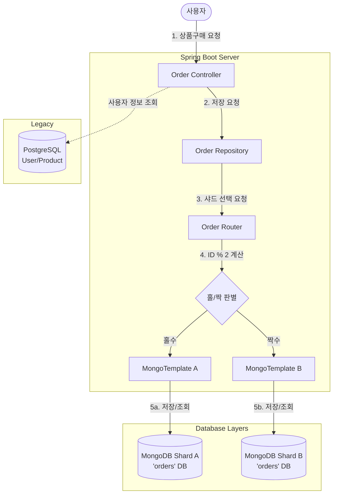

# 11st Benchmarking - Database Migration Walkthrough

이 문서는 기존 **Monolithic RDBMS** 구조에서 **Hybrid Sharding Architecture (RDBMS + NoSQL)**로 전환된 시스템의 구조와 동작 원리를 설명합니다.

---

## 1. 전체 아키텍처 다이어그램 (C4 Level 2)

---

## 2. 핵심 컴포넌트별 역할 (Roles)

이번 마이그레이션에서 추가/변경된 핵심 파일들의 역할입니다.

### 1) `MongoConfig.java` (다중 DB 연결 설정)
*   **역할:** 물리적으로 분리된 두 개의 MongoDB 컨테이너(`mongo-shard-a`, `mongo-shard-b`)에 각각 연결을 맺어줍니다.
*   **동작:** `shardAMongoTemplate`과 `shardBMongoTemplate`이라는 두 개의 "통로(Connection)"를 생성하여 Spring Bean으로 등록합니다.

### 2) `OrderRouter.java` (라우팅 로직)
*   **역할:** "어느 DB로 가야 하는가?"를 결정하는 **나침반**입니다.
*   **로직:**
    *   **DB 선택 (Sharding):** 사용자 ID(`userId`)를 2로 나눈 나머지(`% 2`)를 계산합니다. 홀수면 A, 짝수면 B 템플릿을 반환합니다.
    *   **테이블 선택 (Partitioning):** 현재 연도(`2025`)를 확인하여 `orders_2025`라는 컬렉션 이름을 만들어줍니다.

### 3) `OrderRepository.java` (데이터 접근)
*   **역할:** 라우터를 통해 올바른 DB를 찾고, 실제로 데이터를 **저장(Save)**하거나 **조회(Find)**합니다.
*   **데이터 조립 (Aggregation):** 기존 SQL JOIN을 사용할 수 없으므로, 자바 코드 레벨에서 필요한 데이터(상품 정보 등)를 조립해서 저장합니다.

### 4) `Order.java` & `OrderItem.java` (POJO)
*   **역할:** 데이터를 담는 그릇(Model)입니다.
*   **변경점:** JPA(`@Entity`, `@ManyToOne`) 어노테이션을 모두 제거했습니다. NoSQL은 "관계"가 없는 문서를 저장하므로, 외래키 관계 대신 **ID 값(userId, productId)과 스냅샷 데이터(상품명, 가격)**를 직접 가집니다.

---

## 3. 데이터 흐름 시나리오 (Workflow)

사용자가 상품을 구매했을 때 벌어지는 일련의 과정입니다.

### Step 1. 컨트롤러 요청 수신 (`OrderController`)
사용자가 결제 확인 버튼을 누르면 `/api/orders/confirm-payment`가 호출됩니다.
*   컨트롤러는 `User` 정보를 RDBMS(PostgreSQL)에서 조회하고, 주문 객체(`Order`)를 생성합니다.
*   **중요:** 이때 `Order` 객체에는 `User` 객체 통째로 연결하는 대신 `userId` 값만 넣습니다.

### Step 2. 리포지토리 전달 (`OrderRepository`)
컨트롤러가 `orderRepository.save(order)`를 호출합니다.

### Step 3. 라우팅 및 저장 (`OrderRouter` -> `MongoTemplate`)
1.  리포지토리는 먼저 `order.getUserId()`를 확인합니다. (예: `101`번 유저)
2.  `OrderRouter`에게 묻습니다. "101번은 어디로 가?"
3.  Router: "홀수니까 **Shard A**로 가세요."
4.  리포지토리는 **Shard A**에 연결된 `MongoTemplate`을 집어듭니다.
5.  동시에 "지금 테이블은 어디야?"하고 묻습니다.
6.  Router: "올해는 2025년이니까 **orders_2025** 컬렉션에 넣으세요."
7.  최종적으로 **Shard A**의 **orders_2025** 컬렉션에 JSON 문서 형태로 저장됩니다.

---

## 4. 요약 (Summary)

| 구분 | 기존 (AS-IS) | 변경 후 (TO-BE) |
| :--- | :--- | :--- |
| **저장소** | PostgreSQL (단일) | PostgreSQL (회원/상품) + **MongoDB (주문)** |
| **분산 방식** | 없음 | **User ID 기반 샤딩 (2개 노드)** |
| **테이블 구조** | `orders` 테이블 하나에 누적 | **연도별 (`orders_2024`, `orders_2025`...) 분리** |
| **관계 맺기** | Foreign Key (SQL JOIN) | **NoSQL Document (비정규화/스냅샷)** |

이 구조를 통해 주문 데이터가 아무리 쌓여도 연도별로 분산되고, 사용자가 늘어나도 샤드(서버)만 늘리면 되는 **무한 확장성**을 갖추게 되었습니다.
