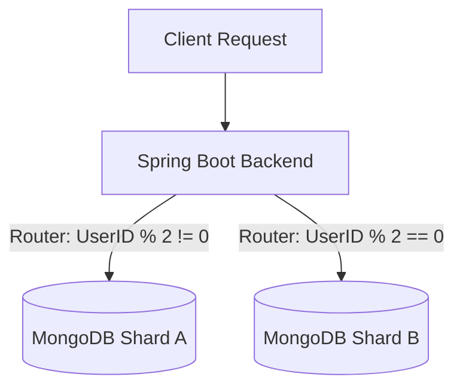

# 🗄️ 데이터베이스 관리 및 분산 처리 정책

## 1. 데이터베이스 아키텍처 개요
본 프로젝트는 데이터의 특성과 확장성을 고려하여 **Polyglot Persistence(다중 저장소)** 및 **Sharding(샤딩)** 아키텍처를 채택하였습니다.

### 1-1. 저장소 구분
| 구분 | 사용 기술 | 역할 | 선정 이유 |
|---|---|---|---|
| **RDBMS** | **PostgreSQL** | 회원, 상품, 카테고리 | 데이터 무결성(ACID) 보장, 관계형 데이터 조회 용이 |
| **NoSQL** | **MongoDB** | 주문 내역 (Sharded) | 대규모 로그성 데이터의 고속 쓰기/읽기, 유연한 스키마 |
| **In-Memory** | **Redis** | 장바구니 | 빠른 I/O 속도, 휘발성 데이터 관리, 자동 만료(TTL) 지원 |
| **Storage** | **AWS S3** | 이미지/정적 파일 | 미디어 자원의 효율적 관리 및 트래픽 분산 |

---

## 2. 주문 데이터베이스 샤딩 (Sharding) 전략

### 2-1. 샤딩 방식 비교: 물리적(Physical) vs 논리적(Logical)
샤딩은 데이터를 나누는 범위에 따라 크게 두 가지로 구분됩니다. 각 방식이 필요한 상황과 예시는 다음과 같습니다.

#### A. 논리적 샤딩 (Logical Sharding / Partitioning)
*   **개념**: 하나의 DB 서버(인스턴스) 내에서 테이블이나 컬렉션만 나누어 저장하는 방식입니다. 하드웨어 자원(CPU, Disk)은 공유합니다.
*   **상황 예시**:
    *   **"데이터 수명 주기 관리"**: 2023년 주문 테이블, 2024년 주문 테이블로 나누어 오래된 데이터를 쉽게 백업하거나 삭제할 때 유리합니다.
    *   **"쿼리 성능 최적화"**: 특정 날짜나 카테고리의 데이터만 빠르게 조회하고 싶을 때 스캔 범위를 줄일 수 있습니다.
*   **한계**: 서버가 하나이기 때문에, 트래픽이 서버 전체 용량을 초과하면 **Scale-Out(서버 확장)**이 불가능합니다.

#### B. 물리적 샤딩 (Physical Sharding)
*   **개념**: 물리적으로 독립된 여러 대의 서버(Docker 컨테이너 등)에 데이터를 분산 저장하는 방식입니다.
*   **상황 예시**:
    *   **"초대규모 트래픽 처리"**: 쿠팡, 11번가 같은 대형 쇼핑몰에서 '광군제/블랙프라이데이' 같은 이벤트로 트래픽이 폭주할 때, 서버를 계속 추가하여 부하를 분산시켜야 합니다.
    *   **"장애 격리 (Fault Isolation)"**: 전체 시스템 다운(Total Outage)을 방지합니다. A 서버가 고장나도 B 서버 사용자는 정상 이용 가능하므로, 피해 범비를 50%로 줄이는 **부분 가용성(Partial Availability)**을 확보합니다. (단, 데이터 복제가 아닌 분할이므로 A 서버 사용자는 복구 시까지 접근 불가)
*   **본 프로젝트의 선택**: **물리적 샤딩** 방식을 채택했습니다.

---

### 2-2. 물리적 샤딩 채택 배경 (Technical Background)
본 프로젝트는 단일 DB 서버의 파티셔닝이 아닌, **Docker 컨테이너를 물리적으로 분리한 샤딩** 방식을 적용했습니다.

> **💡 면접/포트폴리오 핵심 포인트 (Technical Alibi)**
> 일반적으로 소규모 프로젝트에서는 단일 DB가 효율적이나, 다음과 같은 **엔지니어링 학습 및 검증 목적**으로 물리적 분산 구조를 설계했습니다.

1.  **Shared-Nothing Architecture의 이해**
    *   단순 파티셔닝은 자원을 공유하므로 High Traffic 상황에서 DB 서버 자체가 병목이 됩니다.
    *   `mongo_shard_a`, `mongo_shard_b`를 분리하여 **하드웨어 레벨의 Scale-Out 환경을 프로토타이핑**했습니다.

2.  **애플리케이션 레벨 샤딩 (App-Level Sharding) 직접 구현**
    *   자동 샤딩 기능에 의존하지 않고, **애플리케이션 코드(`OrderRouter`)에서 라우팅 로직을 직접 제어**하며 분산 처리 원리를 학습했습니다.
    *   **Routing Logic**: `User ID % 2 == 0` (Shard B), `User ID % 2 != 0` (Shard A)

### 2-3. 샤딩 구성도

---

## 3. 장바구니 데이터 관리 (Redis)
*   **휘발성 데이터의 특성**: 장바구니는 영구 보관보다는 빈번한 갱신과 조회가 발생하며, 일정 기간 후 소멸되어도 무방한 데이터입니다.
*   **고성능 처리를 위한 캐싱**: RDBMS 부하를 줄이고 빠른 반응 속도를 위해 Redis를 도입했습니다.
*   **TTL 설정**: `7일`의 유효기간(Time-To-Live)을 설정하여 오래된 더미 데이터가 자동으로 정리되도록 구성했습니다.

---

## 4. 이미지 및 정적 파일 관리 (AWS S3)
*   **오브젝트 스토리지 도입**: 이미지는 DB에 직접 저장(BLOB)하면 DB 성능을 급격히 저하시킵니다. 이를 방지하기 위해 AWS S3를 사용합니다.
*   **CDN 연동**: S3에 저장된 정적 파일은 CDN(CloudFront)을 통해 전 세계 어디서든 빠르게 로딩됩니다.
*   **비용 효율성**: 자주 쓰지 않는 오래된 이미지는 저렴한 스토리지 클래스로 자동 이동(Lifecycle Rule)시켜 비용을 절감할 수 있습니다.

---

## 5. 저장소별 장단점 비교 (Pros & Cons)

| 저장소 | 장점 (Pros) | 단점 (Cons) | 본 프로젝트 활용처 |
| :--- | :--- | :--- | :--- |
| **PostgreSQL** (RDBMS) | • **데이터 무결성(ACID)** 보장 • 복잡한 관계(JOIN) 처리 강력함 • 표준 SQL 사용으로 유지보수 용이 | • 대용량 처리 시 확장이 어려움 (Scale-Up 위주) • 스키마 변경 시 서비스 중단 위험 존재 | **회원 정보, 상품 정보** (정확성이 생명인 데이터) |
| **MongoDB** (NoSQL) | • **Schema-less**: 데이터 구조 변경이 자유로움 • **Scale-Out**: 샤딩을 통한 무한 확장이 용이 • 대량의 로그성 데이터 쓰기 성능 우수 | • 복잡한 트랜잭션 처리가 RDBMS보다 약함 • 데이터 중복 발생으로 저장 공간 소모 큼 | **주문 내역** (형식이 다양하고 양이 많은 데이터) |
| **Redis** (In-Memory) | • **압도적인 속도** (Microsecond 단위) • 다양한 자료구조(List, Set 등) 지원 • 만료 시간(TTL) 지정 가능 | • 메모리(RAM) 가격이 비쌈 • 서버 재시작 시 데이터 유실 위험 (Persistence 설정 필요) | **장바구니** (빠르고 임시적인 데이터) |
| **AWS S3** (Object Storage) | • **무제한 용량** & 높은 내구성 (99.999%...) • 웹 서버 트래픽 부하를 획기적으로 줄여줌 • HTTP로 바로 접근 가능 | • 파일 수정이 불가능 (덮어쓰기만 가능) • 요청 횟수 당 과금 발생 | **상품 이미지** (DB에 넣기엔 너무 큰 파일들) |
