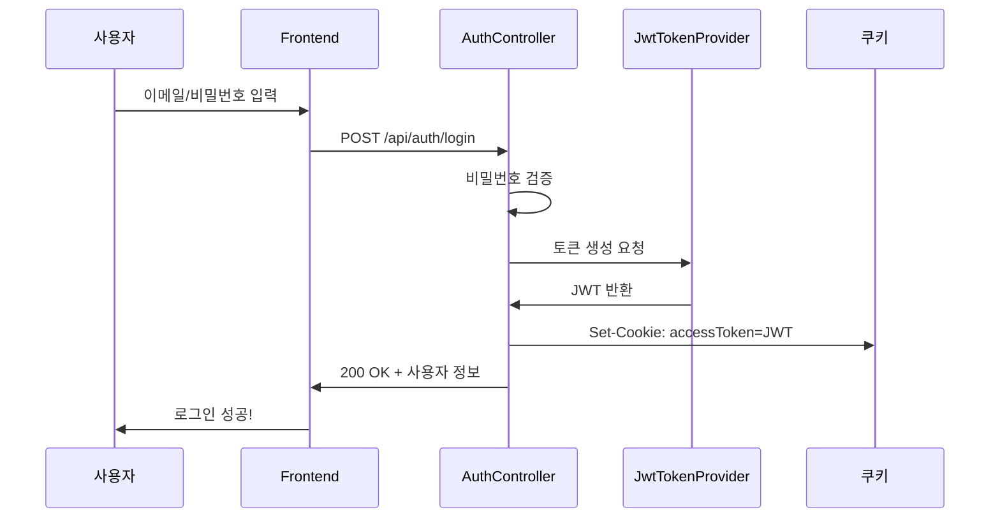
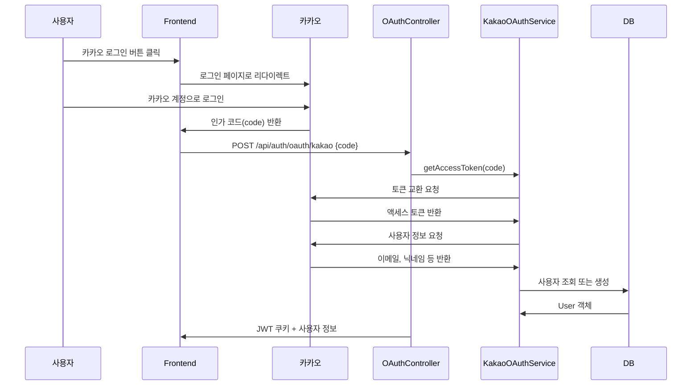
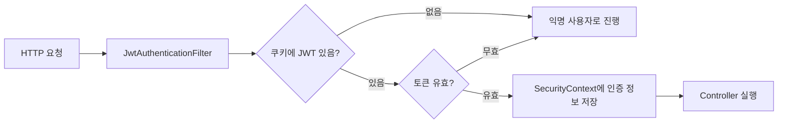

# JWT와 카카오 OAuth 완벽 가이드 🔐

> 이 프로젝트의 실제 코드를 기반으로 JWT와 카카오 로그인을 이해합니다.

---

## 📁 관련 파일 목록

| 파일 | 역할 |
|------|------|
| [JwtTokenProvider.java](file:///c:/Users/yoons/OneDrive/문서/GitHub/11st_Benchmarking/backend/src/main/java/com/clone/backend/security/JwtTokenProvider.java) | JWT 생성 및 검증 |
| [JwtAuthenticationFilter.java](file:///c:/Users/yoons/OneDrive/문서/GitHub/11st_Benchmarking/backend/src/main/java/com/clone/backend/security/JwtAuthenticationFilter.java) | 요청마다 JWT 검사 |
| [KakaoOAuthService.java](file:///c:/Users/yoons/OneDrive/문서/GitHub/11st_Benchmarking/backend/src/main/java/com/clone/backend/service/KakaoOAuthService.java) | 카카오 OAuth 처리 |
| [AuthController.java](file:///c:/Users/yoons/OneDrive/문서/GitHub/11st_Benchmarking/backend/src/main/java/com/clone/backend/controller/AuthController.java) | 일반 로그인/회원가입 |
| [OAuthController.java](file:///c:/Users/yoons/OneDrive/문서/GitHub/11st_Benchmarking/backend/src/main/java/com/clone/backend/controller/OAuthController.java) | 카카오 OAuth 콜백 |
| [SecurityConfig.java](file:///c:/Users/yoons/OneDrive/문서/GitHub/11st_Benchmarking/backend/src/main/java/com/clone/backend/config/SecurityConfig.java) | Spring Security 설정 |

---

## 1️⃣ JWT란? (JSON Web Token)

### JWT 구조

```
HEADER.PAYLOAD.SIGNATURE
```

```
eyJhbGciOiJIUzUxMiJ9.eyJzdWIiOiJ1c2VyQGVtYWlsLmNvbSIsImlhdCI6MTcwMjY1...
        ↑                           ↑                                ↑
     Header                      Payload                         Signature
```

| 부분 | 내용 | 예시 |
|------|------|------|
| **Header** | 알고리즘, 토큰 타입 | `{"alg": "HS512", "typ": "JWT"}` |
| **Payload** | 사용자 정보 (Claims) | `{"sub": "user@email.com", "exp": 1702...}` |
| **Signature** | 위변조 방지 서명 | 비밀키로 암호화된 값 |

### 이 프로젝트의 JWT 생성 코드

```java
// JwtTokenProvider.java (Line 35-40)
return Jwts.builder()
        .setSubject(username)          // 사용자 이메일
        .setIssuedAt(new Date())       // 발급 시간
        .setExpiration(new Date(...))  // 만료 시간
        .signWith(getSigningKey(), SignatureAlgorithm.HS512)  // 서명
        .compact();
```

> **HS512**: HMAC-SHA512 알고리즘. 비밀키(Secret)를 사용한 대칭 암호화.

---

## 2️⃣ 인증 흐름 (일반 로그인)



### 주요 코드 설명

```java
// AuthController.java (Line 58-64)
ResponseCookie cookie = ResponseCookie.from("accessToken", jwt)
        .httpOnly(true)   // JavaScript에서 접근 불가 (XSS 방지)
        .secure(false)    // HTTPS에서만 전송 (개발 중은 false)
        .path("/")        // 모든 경로에서 쿠키 전송
        .maxAge(24 * 60 * 60)  // 24시간 유효
        .sameSite("Lax")  // CSRF 방지
        .build();
```

---

## 3️⃣ 카카오 OAuth 2.0 흐름



### 단계별 코드 분석

#### Step 1: 인가 코드 → 액세스 토큰 교환

```java
// KakaoOAuthService.java (Line 46-76)
public String getAccessToken(String code) {
    String tokenUrl = "https://kauth.kakao.com/oauth/token";

    MultiValueMap<String, String> params = new LinkedMultiValueMap<>();
    params.add("grant_type", "authorization_code");
    params.add("client_id", clientId);        // 카카오 앱 키
    params.add("client_secret", clientSecret);
    params.add("redirect_uri", redirectUri);
    params.add("code", code);                 // 프론트에서 받은 인가 코드

    // POST 요청 후 access_token 반환
}
```

#### Step 2: 액세스 토큰으로 사용자 정보 조회

```java
// KakaoOAuthService.java (Line 82-102)
public Map<String, Object> getUserInfo(String accessToken) {
    HttpHeaders headers = new HttpHeaders();
    headers.setBearerAuth(accessToken);  // Authorization: Bearer {토큰}

    // GET https://kapi.kakao.com/v2/user/me
    // 반환: {id, kakao_account: {email, profile: {nickname}}}
}
```

#### Step 3: 사용자 생성/조회 + JWT 발급

```java
// OAuthController.java (Line 47-61)
User user = kakaoOAuthService.findOrCreateUser(kakaoUserInfo);
String jwtToken = jwtTokenProvider.generateTokenFromEmail(user.getEmail());

Cookie cookie = new Cookie("accessToken", jwtToken);
cookie.setHttpOnly(true);
// ... 쿠키 설정 후 응답
```

---

## 4️⃣ 매 요청마다 인증 검사



### 핵심 코드

```java
// JwtAuthenticationFilter.java (Line 43-54)
String jwt = getJwtFromCookie(request);  // 쿠키에서 토큰 추출

if (StringUtils.hasText(jwt) && tokenProvider.validateToken(jwt)) {
    String email = tokenProvider.getUserEmailFromToken(jwt);
    UserDetails userDetails = userDetailsService.loadUserByUsername(email);
    
    // Spring Security에 인증 정보 저장
    SecurityContextHolder.getContext().setAuthentication(authentication);
}
```

---

## 5️⃣ 보안 설정 (SecurityConfig)

```java
// SecurityConfig.java (Line 37-49)
http
    .csrf(csrf -> csrf.disable())          // JWT 사용시 CSRF 보호 불필요
    .sessionManagement(session -> 
        session.sessionCreationPolicy(SessionCreationPolicy.STATELESS))  // 세션 사용 안 함
    .authorizeHttpRequests(auth -> auth
        .requestMatchers("/api/auth/**", "/api/products/**").permitAll()  // 공개 API
        .anyRequest().authenticated())                                     // 나머지는 인증 필요
    .addFilterBefore(jwtAuthenticationFilter, UsernamePasswordAuthenticationFilter.class);
```

---

## 6️⃣ 핵심 개념 정리

| 개념 | 설명 |
|------|------|
| **JWT** | 서버가 세션을 저장하지 않고 토큰으로 인증 상태를 관리 |
| **HS512** | 비밀키 기반 서명 알고리즘 (대칭키) |
| **HttpOnly 쿠키** | JavaScript에서 접근 불가 → XSS 공격 방지 |
| **Stateless** | 서버가 세션을 저장하지 않음 → 확장성↑ |
| **OAuth 2.0** | 제3자(카카오)에게 인증을 위임하는 표준 프로토콜 |
| **인가 코드** | 사용자가 카카오에 로그인 후 받는 일회용 코드 |
| **액세스 토큰** | 카카오 API를 호출할 수 있는 실제 권한 토큰 |

---

## 7️⃣ 보안 주의사항

> [!WARNING]
> **프로덕션 배포 전 체크리스트**

1. `jwt.secret`을 **256비트 이상**의 안전한 값으로 변경
2. `cookie.setSecure(true)` 설정 (HTTPS 필수)
3. 카카오 `client_secret`을 환경변수로 관리
4. 토큰 만료 시간 적절히 설정 (너무 길면 위험)
