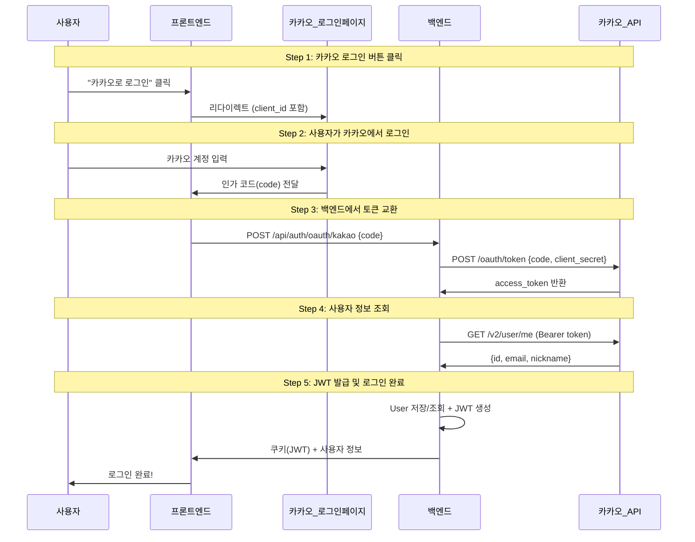
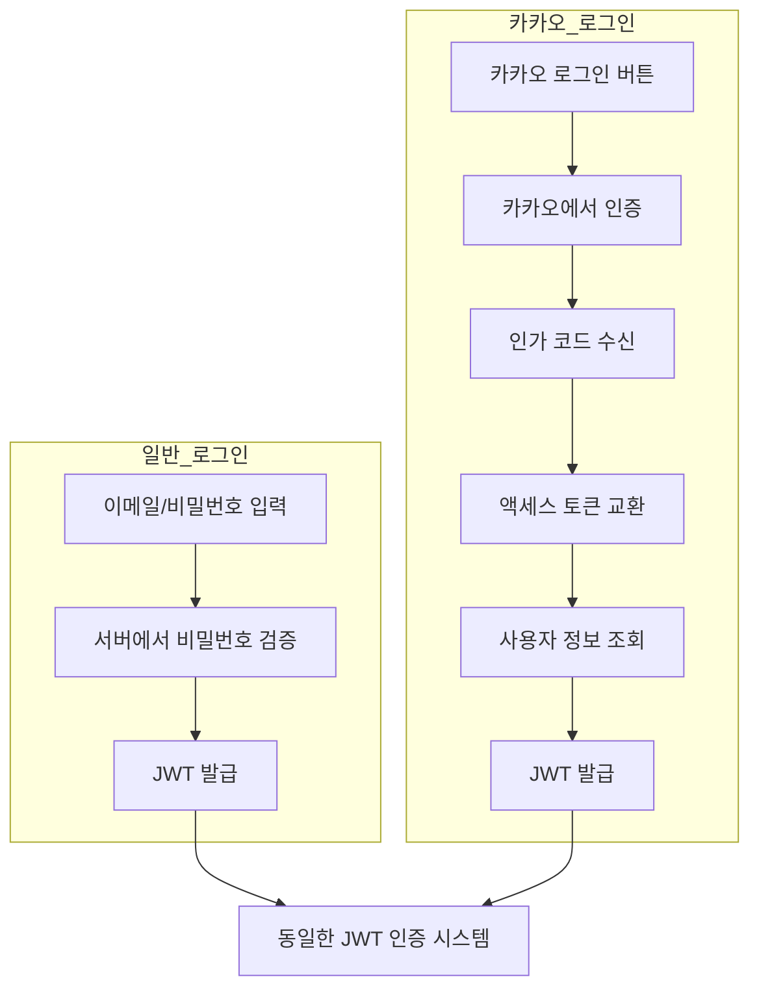

# 카카오 OAuth 로그인 완벽 이해 🔑

> OAuth 2.0 프로토콜과 카카오 API를 활용한 소셜 로그인 구현

---

## 📁 관련 파일

| 파일 | 역할 |
|------|------|
| [KakaoOAuthService.java](file:///c:/Users/yoons/OneDrive/문서/GitHub/11st_Benchmarking/backend/src/main/java/com/clone/backend/service/KakaoOAuthService.java) | 카카오 API 호출 (토큰 교환, 사용자 정보) |
| [OAuthController.java](file:///c:/Users/yoons/OneDrive/문서/GitHub/11st_Benchmarking/backend/src/main/java/com/clone/backend/controller/OAuthController.java) | OAuth 콜백 처리 엔드포인트 |
| [KakaoCallback.jsx](file:///c:/Users/yoons/OneDrive/문서/GitHub/11st_Benchmarking/src/pages/KakaoCallback.jsx) | 프론트엔드 콜백 페이지 |

---

## 1️⃣ OAuth 2.0이란?

**"다른 서비스의 인증을 빌려 쓰는 표준 프로토콜"**

```
우리 서비스: "이 사람 누군지 알려줘"
카카오: "이 사람은 홍길동이고 이메일은 xxx@kakao.com이야"
우리 서비스: "고마워! 이제 우리 서비스에서 로그인 처리할게"
```

---

## 2️⃣ 전체 흐름도



---

## 3️⃣ 단계별 상세 설명

### Step 1: 카카오 로그인 페이지로 이동

사용자가 "카카오 로그인" 버튼을 클릭하면 카카오 로그인 페이지로 리다이렉트됩니다.

```
https://kauth.kakao.com/oauth/authorize
  ?client_id=df51448645c334cdd1f85b5521edfe51
  &redirect_uri=http://localhost:5173/oauth/kakao/callback
  &response_type=code
```

| 파라미터 | 설명 |
|----------|------|
| `client_id` | 카카오 개발자 콘솔에서 발급받은 앱 키 |
| `redirect_uri` | 로그인 후 돌아올 우리 서비스 URL |
| `response_type` | `code` = 인가 코드 방식 사용 |

---

### Step 2: 인가 코드 수신 (프론트엔드)

카카오에서 로그인 성공 후, 사용자를 우리 서비스로 리다이렉트합니다:

```
http://localhost:5173/oauth/kakao/callback?code=AbCdEf123456...
```

```jsx
// KakaoCallback.jsx (Line 18, 28-31)
const code = searchParams.get('code');  // URL에서 인가 코드 추출

if (code) {
    handleKakaoLogin(code);  // 백엔드로 전송
}
```

> **인가 코드**는 **일회용**이며, **10분 내에 사용**해야 합니다.

---

### Step 3: 액세스 토큰 교환 (백엔드)

인가 코드를 카카오 서버에 보내서 **액세스 토큰**으로 교환합니다.

```java
// KakaoOAuthService.java (Line 46-75)
public String getAccessToken(String code) {
    String tokenUrl = "https://kauth.kakao.com/oauth/token";

    MultiValueMap<String, String> params = new LinkedMultiValueMap<>();
    params.add("grant_type", "authorization_code");
    params.add("client_id", "df51448645c334cdd1f85b5521edfe51");
    params.add("client_secret", "Q368vjeRqOJ3vfFHjczZHvToFjPJm9kB");
    params.add("redirect_uri", "http://localhost:5173/oauth/kakao/callback");
    params.add("code", code);

    // POST 요청 후 access_token 추출
}
```

**카카오 응답 예시:**
```json
{
  "access_token": "xxxxxxxxxxxxxxxxxxxxxxxxxxxxxxxxxxxxxx",
  "token_type": "bearer",
  "refresh_token": "yyyyyyyyyyyyyyyyyyyyyyyyyyyyyyyyyyyyyy",
  "expires_in": 21599
}
```

---

### Step 4: 사용자 정보 조회

액세스 토큰으로 카카오 사용자 정보 API를 호출합니다.

```java
// KakaoOAuthService.java (Line 82-101)
public Map<String, Object> getUserInfo(String accessToken) {
    HttpHeaders headers = new HttpHeaders();
    headers.setBearerAuth(accessToken);  // Authorization: Bearer {token}

    // GET https://kapi.kakao.com/v2/user/me
}
```

**카카오 응답 예시:**
```json
{
  "id": 1234567890,
  "kakao_account": {
    "email": "user@kakao.com",
    "profile": {
      "nickname": "홍길동"
    }
  }
}
```

---

### Step 5: 사용자 생성/조회 + JWT 발급

```java
// KakaoOAuthService.java (Line 108-145)
public User findOrCreateUser(Map<String, Object> kakaoUserInfo) {
    // 기존 사용자 조회
    Optional<User> existingUser = userRepository.findByEmail(email);
    if (existingUser.isPresent()) {
        return existingUser.get();  // 기존 회원
    }

    // 신규 사용자 생성
    User newUser = User.builder()
            .email(email)
            .name(nickname)
            .password("KAKAO_OAUTH_USER_" + kakaoId)  // 더미 비밀번호
            .points(1000)  // 가입 축하 포인트
            .build();
    return userRepository.save(newUser);
}
```

```java
// OAuthController.java (Line 50-58)
String jwtToken = jwtTokenProvider.generateTokenFromEmail(user.getEmail());

Cookie cookie = new Cookie("accessToken", jwtToken);
cookie.setHttpOnly(true);
response.addCookie(cookie);
```

---

## 4️⃣ 왜 이렇게 복잡할까?

### 보안상의 이유

| 단계 | 보안 목적 |
|------|----------|
| 인가 코드 방식 | 액세스 토큰이 브라우저에 노출되지 않음 |
| client_secret | 백엔드에서만 사용 (프론트에 노출 X) |
| 일회용 코드 | 탈취 당해도 재사용 불가 |
| HttpOnly 쿠키 | XSS 공격으로 JWT 탈취 방지 |

---

## 5️⃣ 카카오 개발자 설정

### 필요한 설정 (https://developers.kakao.com)

1. **앱 생성** → REST API 키 발급
2. **동의 항목** → 이메일, 닉네임 동의 설정
3. **Redirect URI** → `http://localhost:5173/oauth/kakao/callback` 등록
4. **Client Secret** → 보안 → Client Secret 발급

### application.properties

```properties
kakao.client-id=df51448645c334cdd1f85b5521edfe51
kakao.client-secret=Q368vjeRqOJ3vfFHjczZHvToFjPJm9kB
kakao.redirect-uri=http://localhost:5173/oauth/kakao/callback
```

---

## 6️⃣ 핵심 용어 정리

| 용어 | 설명 |
|------|------|
| **인가 코드 (Authorization Code)** | 사용자가 로그인 후 받는 일회용 코드 |
| **액세스 토큰 (Access Token)** | 카카오 API를 호출할 수 있는 권한 토큰 |
| **리프레시 토큰 (Refresh Token)** | 액세스 토큰 만료 시 재발급용 |
| **Client ID** | 앱 식별자 (공개 가능) |
| **Client Secret** | 앱 비밀키 (백엔드에서만 사용) |

---

## 7️⃣ 일반 로그인 vs 카카오 로그인


